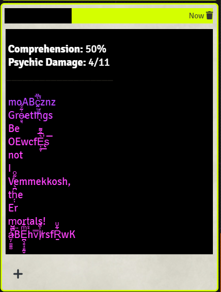

# Far Speech

This script will garble a provided message using either the intelligibility percentage provided or by dividing the receiver's intelligence by the sender's intelligence.

We garble the message in several ways:

- reordering of words in message
- word replacement with synonyms
- letter replacement
- [zalgo](https://lingojam.com/ZalgoText)

Additionally, we colorize the output text to represent sentiment analysis.

- **red**: negative
- **purple**: neutral
- **blue**: positive

## Execution

- `node FarSpeech.js --s <senderInt> --r <receiverInt> --m "hello world"`
- `node FarSpeech.js --p <percentComprehension> --m "hello world"`

### Flags

| Flag  | Verbose Flag   | Description | Required |
|:-----:|:---------------|:------------|:---------|
| `--s` | `--sender`     | sender intelligence | required if not using `--p` |
| `--r` | `--receiver`   | receiver intelligence | required if not using `--p` |
| `--p` | `--percentage` | comprehension percent | required if not using `--s` and `--r` |
| `--m` | `--message`    | message to garble | required |

## Examples

[see here](examples/examples.md)

## License

[EPL 2.0](license.md)
