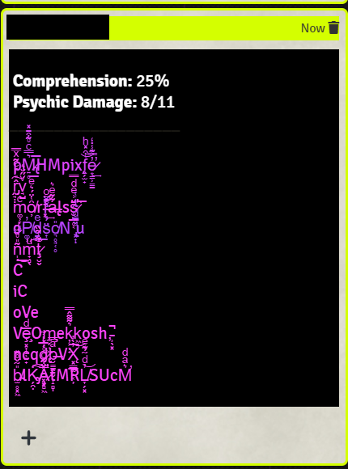

# Examples

## Verbose Example

### Input

`$ node FarSpeech.js --s 28 --r 20 --m "Greetings mortals! Be not afraid. I am Vemmekkosh, the friendly balestrider."`

### Output

``` bash
Prime Message: Greetings mortals! Be not afraid. I am Vemmekkosh, the friendly balestrider.
Overall Sentiment: -0.09090909090909091
Post-Reorder: afraid. balestrider. mortals! Be not I am Greetings Vemmekkosh, the friendly
Post-Synonym: afraid. balestrider. mortals! Be not I am Greetings Vemmekkosh, the friendly


<p style="background-color:black;">
&nbsp;<a style="color:white"><b>Comprehension:</b> 71.4%</a>&nbsp;
&nbsp;<a style="color:white"><b>Psychic Damage:</b> 2/11</a>&nbsp;
___________________<br/>
&nbsp;<a style="color:#ff44fc;">H̜̻OKUoRm</a>&nbsp;
&nbsp;<a style="color:#ff44fc;">bale̵̜͘strider.</a>&nbsp;
&nbsp;<a style="color:#ff44fc;">mortals!</a>&nbsp;
&nbsp;<a style="color:#ff44fc;">Be</a>&nbsp;
&nbsp;<a style="color:#ff44fc;">not</a>&nbsp;
&nbsp;<a style="color:#ff44fc;">I</a>&nbsp;
&nbsp;<a style="color:#ff44fc;">ip</a>&nbsp;
&nbsp;<a style="color:#dd44ff;">Greetings</a>&nbsp;
&nbsp;<a style="color:#ff44fc;">Vemmekkosh,</a>&nbsp;
&nbsp;<a style="color:#ff44fc;">the</a>&nbsp;
&nbsp;<a style="color:#b844ff;">friendly</a><br/>&nbsp;</p>
```

### HTML Pasted into FoundryVTT Chat


## Simple Examples

### 0%

`$ node FarSpeech.js --p 0 --m "Greetings mortals! Be not afraid. I am Vemmekkosh, the friendly balestrider."`


### 25%

`$ node FarSpeech.js --p 25 --m "Greetings mortals! Be not afraid. I am Vemmekkosh, the friendly balestrider."`



### 50%

`$ node FarSpeech.js --p 50 --m "Greetings mortals! Be not afraid. I am Vemmekkosh, the friendly balestrider."`


### 75%

`$ node FarSpeech.js --p 75 --m "Greetings mortals! Be not afraid. I am Vemmekkosh, the friendly balestrider."`


### 100%

`$ node FarSpeech.js --p 100 --m "Greetings mortals! Be not afraid. I am Vemmekkosh, the friendly balestrider."`


